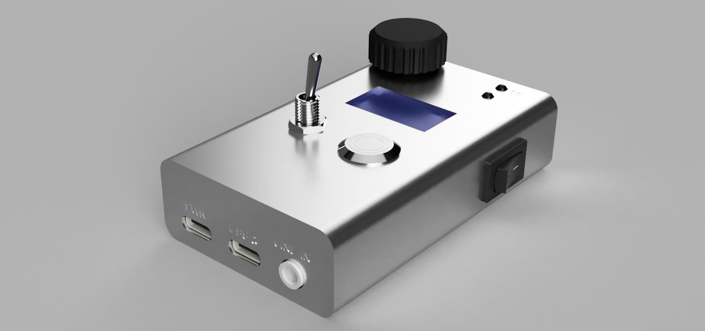

# sstc-interrupter-esp32

**Still in development! Maybe unstable.**

> This project implements a digital interrupter for any Solid State Tesla Coils (SSTC, DRSSTC, ...). The interrupter allows precise control over the arc output using different control modes, making it easy to experiment with pulse timing, audio modulation, or MIDI control.

## Features
- **Three Control Modes**
    - Manual: Fully custom PWM output from 0 to 20 kHz, with 1 µs minimum pulse width.
    - Line-In: Samples audio input via jack at 16 kHz, modulates PWM at 30 kHz carrier.
    - USB MIDI: Synthesizes sinusoidal notes, supports polyphonic chords, and modulates PWM at 30 kHz carrier.

- **User Interface**
    - SSD1306 64x128 monochrome display
    - Rotary encoder for navigation
    - Two triggers: toggle switch and push button
    - Nice and simple graphical interface

- **Connectivity**
    - USB-C for power input only
    - USB-C OTG/Serial for MIDI/Programming
    - 3.5 mm audio jack input
    - Toslink SPDIF output

- **Hardware Efficiency**
    - Written entirely in C using ESP-IDF
    - Real-time control via FreeRTOS
    - Optimized for ESP32-S3 hardware: LEDC, RMT, GPTIMER, ADC
    - Battery powered (200 mAh)

## RoadMap

- 📍 Implement advanced MIDI features (velocity, aftertouch)
- 📍 Implement real-time waveform visualization
- 📍 Add configuration presets and saving to flash

## Project Structure

``` text
sstc-interrupter-esp32/
├── LICENSE                   # Project license
├── README.md                 # This file
├── docs/                     # Documentation, schematics, and guides
├── firmware/                 # ESP-IDF firmware project
│   ├── CMakeLists.txt
│   ├── dependencies.lock
│   ├── main/
│   │   ├── CMakeLists.txt
│   │   ├── Kconfig.projbuild # Custom menuconfig for pinout & constraints
│   │   ├── app/              # High-level application logic
│   │   │   ├── clients/      # Protocol clients (e.g., USB MIDI)
│   │   │   ├── gui/          # Graphical User Interface (LVGL)
│   │   │   └── main.c        # Program entry point (init, orchestrate, ...)
│   │   ├── core/             # Event handling
│   │   ├── hal/              # Hardware Abstraction Layer (synth, USB, display, jack, etc.)
│   │   └── idf_component.yml
│   ├── sdkconfig
│   └── sstc_interrupter-esp32.eez-project # EEZ-Studio project for LVGL GUI design
└── hardware/
    ├── cad/                  # 3D models, STLs, and mechanical design
    └── pcb/                  # Printed Circuit Board designs and gerbers
```


## Documentation
***soon***

## Contributing
Contributions are welcome! You can help by:
- Reporting issues or bugs
- Improving UI graphics
- Optimizing PWM and audio processing
- Adding features (more control modes, presets, etc.)
- Updating documentation and schematics

**Please note:** This project involves high-voltage electronics. Take appropriate safety precautions and ensure optical isolation between the interrupter and the Tesla coil.
